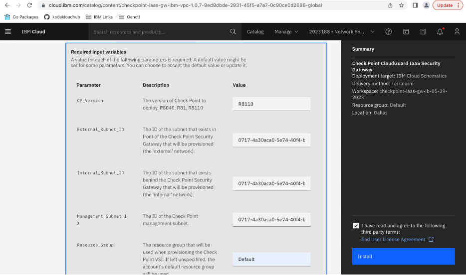
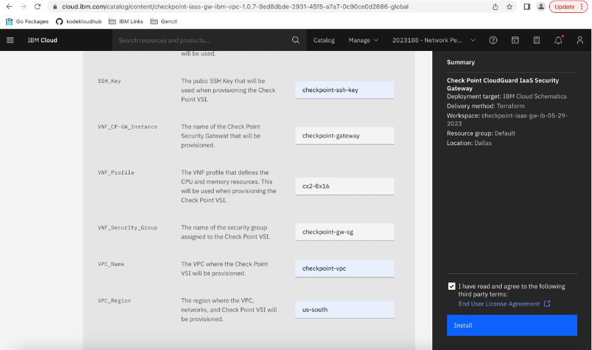

Click on IBM Cloud Catalog and then search for Checkpoint CloudGuard IaaS Security Gateway.
 

Keep the deployment target, delivery method and product version as it is by default.
 

Now configure your workspace with a unique name and a desired location.
 

To fill the required input variables, refer to the description for the deployment parameters taken
from the readme file. After filling all the required input variables, read and agree to the third-
party terms and then click on Install.
 
 
  
  
You can now see Cart creation in progress.
 

After Cart creation is successful, Terraform commands start running.
 

If it fails, check for Log and resolve the error.
Wait until the Applied plan is successful and the resource shows ‘Active’.
 

From the left navigation menu, go to ‘VPC Infrastructure’ and click on ‘Virtual Server Instances’. You can see the name and details of the instance you just created. Note its Floating IP. If it is null then check the next steps to create a new Floating IP for the instance.
 

Click on the instance name and then below page will appear. Then in the Network-interfaces section edit the interface which has the same subnet you provided while creating the instance.
 

Then from the ‘Floating IP address’ dropdown menu select ‘Reserve a new floating IP’ and save the changes.
 

You can see a new Floating IP got attached to the interface.
 

Now Open your command prompt and run the command ‘ssh admin@<floating\_ip>’ to log into the
system with this IP.

Then set a password by running the command ‘set user admin password’
 

Follow the steps in [CheckPointGatewayConfig.md](https://github.ibm.com/orion/vnf-vpc-docs/blob/master/Vendors/CheckPoint/UIConfiguration/CheckPointGatewayConfig.md) to configure the Checkpoint Management
Server.

Note:
▪ For Step 1, use the Floating IP from above.
▪ For Step 2, use username as ‘admin’ and password as the one set above.
▪ For Step 3, provide a new admin Password and then onwards always use the new admin Password to login again.
