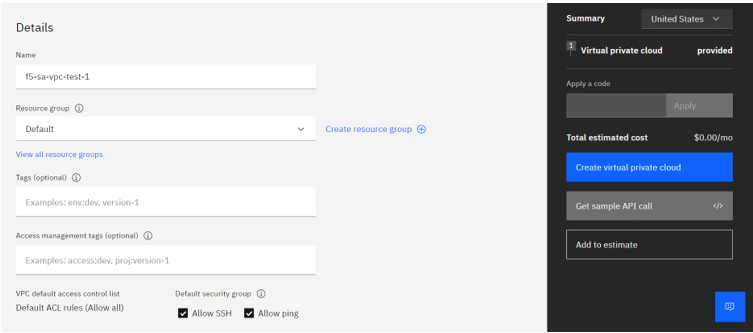

## Standalone-F5-Steps

1.	Log in to your IBM Cloud account and click on Navigation Menu on the left.

    
	
2.	Select VPC Infrastructure > VPCs

    

3.	In the Virtual Private Clouds page click on Create to create a new VPC

    

4. select desired Location from the drop-down menu and give a unique name to your new VPC

    
	
5.	Use default values for resource and security groups. Specify tags if required.

    
	
6.	Three subnets will be created for you by default when creating a new VPC. Click on Add Subnet to more subnets.

    
	
7.	Provide a new name or use the suggested name for your subnet and select the desired zone from the drop-down. Let the other options have default values and then click on Create.

    
	
8.	I have created 4 subnets (internal, external, management, cluster) in dallas2 zone to use in both VSI’s (default subnets were already present in dallas1). Now, click on Create virtual private cloud button on your right. Verify whether your VPC is created successfully.

    
	
    
	
9.	Click on SSH keys option on the navigation menu to create a SSH key for your VPC and click on create.

    
	
10.	Select appropriate location from the drop-down, give a name, input your public ssh key and click on create. Follow the instructions given in this website if you are not aware of how to generate an SSH key. Verify whether your key is created successfully.

    
	
11.	Search for F5 in the catalog and select F5 BIG-IP Virtual Edition for VPC and create as below by providing the Ext-subnet Id, management-subnet Id and the SSH key name.

    
	
    Scroll down and provide Ext-subnet Id, management-subnet Id and the SSH key name.
	
    
	
    Click the Optional one and modify as below:

In Optional, also provide tmos_admin_password, toggle all yes to no in secrets, big_management_floating_ip should be true.
	
	
	Check the checkbox and click Install.
	
	Same way we have created 2nd VSI
		
	Virtual sever instance is created.
