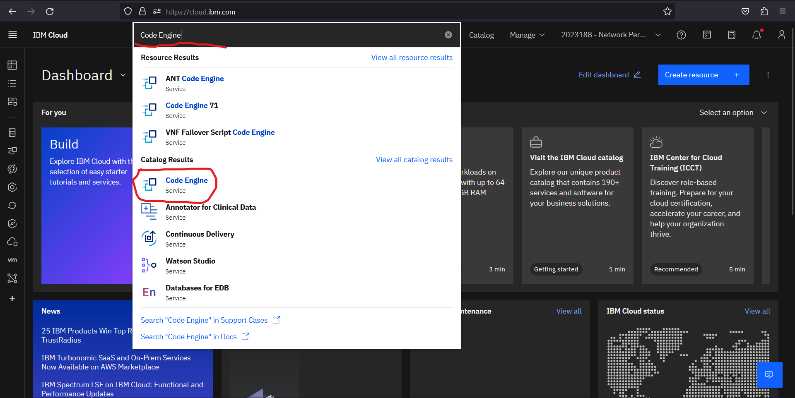
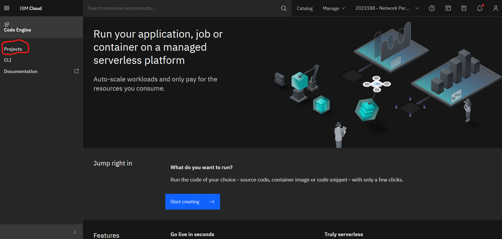
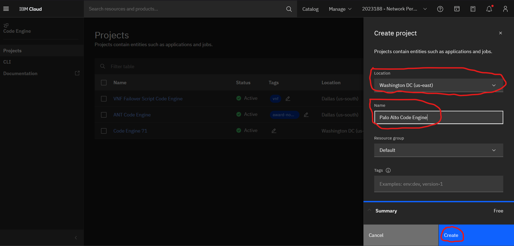
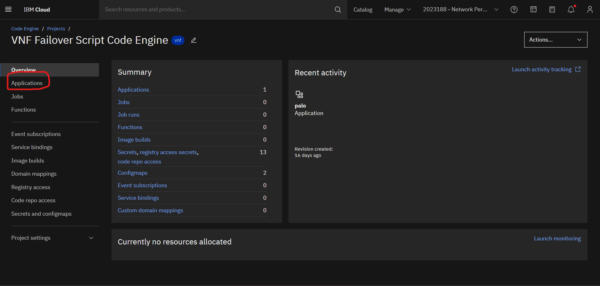
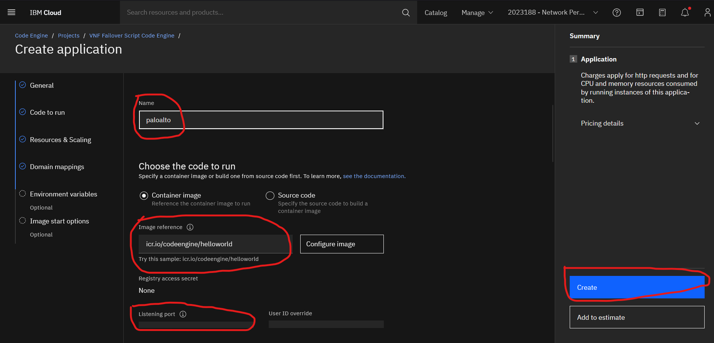
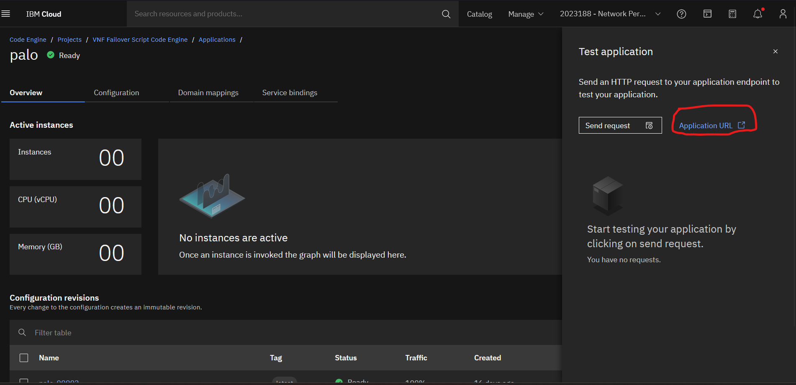
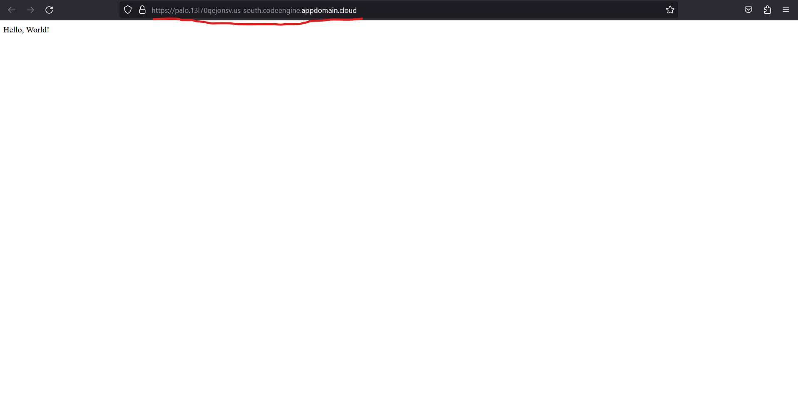

## Failover script using Code Engine

### Prerequisite

-> Use the provided docker file to create a docker image of the script providing all necessary environment variables in .env file.\
``
docker build -t <your-registry-name>/<image-name>:<your-tag> .
``\
-> Upload the image into a image registry platform(IBM Registry, Docker Hub etc).

### Code Engine Setup in IBM Cloud

-> Log in to IBM Cloud.\
-> Search for “Code Engine” in “ Search Resource and Product” box.

-> Click on “Project” from the left panel.

-> Create a new project by providing unique name and selecting the region where the VNFs resides. Then, click on create.

-> After creating a project, create an application by clicking the “Application” option from left panel.

-> Provide a unique name, select “Container Image” and provide the image reference path. Also provide the port number(if any) to which the app would be listening and leave the rest of the default settings. Then, click on “Create”.

-> 	After a container is successfully created, test the link by clicking on the top right “Test Application” option and then on “Application URL”.

-> Copy the link opened in the new browser tab.

