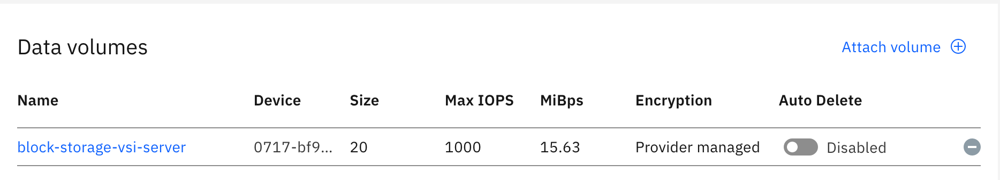

### Example to illustrate how a VSI can use Block Storage as data volume to store mongo db data.   

The intent of this article is to walk you through the process that are involved in setting up a virtual server instance (VSI) with block storage as data volume to store mongo db data in the IBM Cloud VPC. Since, the mongo db data is stored in Block Storage volume, any Virtual Server Instance can mount the data from Block storage, use it as a secondary volume and reuse the mongo db data.   

After the setup, you can configure private dns, mongo db in the server VSI and connect to mongo db from a client VSI that is running nodejs application. The client and server will communicate using Private DNS (p-DNS).

The example below illustrates how a Virtual Server Instance in IBM Cloud VPC can use Block Storage as data volume to store mongo db data.  


The reader will get to know the steps to attach a Block Storage to a VSI and configure MongoDB:

- Create Block Storage volume. 
- Partition the volume, format the volume, and then mount it as a file system in Server VSI. 
- Install Docker and Mongodb as docker container.
- Run Mongodb container and use the mounted secondary block volume. 
- Create a database in mongo db.
- Connect to Mongodb using mongo client and test whether setup works.    

> Prerequisite:

- IBM Cloud account.   
- Follow the steps from [Example to illustrate how a nodejs application can access Mongo DB using Private DNS](https://github.com/IBM-Cloud/vnf-samples/blob/master/pdns-mongo-nodejs/README.md) and create a Server VSI, Client VSI and private dns (testb.testpdns.com)

**Apply Terraform**   

1. Run the command to initialize ibm terraform provider:  
> terraform init

2. Run the command to apply terraform:  
> terraform apply

3. It will create 3 VSI: 1 client VSI and 2 Server VSIs. One of the server VSI is attached to a block storage volume(resource **ibm_is_volume** "volume" is attached to the resource **ibm_is_instance** "test_schematics_demo_vsi_server_1"") with size 20 GB as shown below:  



**Mount the Block Storage Volume to Server 1 VSI**  

1. Next, lets follow this procedure to use block storage volume on ubuntu system . Steps to format and mount block storage volume : https://github.com/hkantare/terraform-vpc-db/blob/master/playbooks/mount.yml

a) Login to the Server VSI using floating ip address. 

ssh root@floating ip of server vsi 1

b) Run the command **df -Th** :  

Here, you can see that the data volume 20GB is not shown.    

```
root@server-1:~# df -Th
Filesystem     Type      Size  Used Avail Use% Mounted on
udev           devtmpfs  3.7G     0  3.7G   0% /dev
tmpfs          tmpfs     743M  660K  742M   1% /run
/dev/vda2      ext4       99G  1.5G   93G   2% /
tmpfs          tmpfs     3.7G     0  3.7G   0% /dev/shm
tmpfs          tmpfs     5.0M     0  5.0M   0% /run/lock
tmpfs          tmpfs     3.7G     0  3.7G   0% /sys/fs/cgroup
/dev/vda1      ext3      240M   73M  155M  33% /boot
tmpfs          tmpfs     743M     0  743M   0% /run/user/0
```
c) Run the command **fdisk -l** :  

Here, you can see that the data volume 20GB is shown under Disk /dev/vdd but it is not mounted to this server.    
```
root@server-1:~# fdisk -l
Disk /dev/vda: 100 GiB, 107372544000 bytes, 209712000 sectors
Units: sectors of 1 * 512 = 512 bytes
Sector size (logical/physical): 512 bytes / 512 bytes
I/O size (minimum/optimal): 512 bytes / 512 bytes
Disklabel type: dos
Disk identifier: 0x9493729e

Device     Boot  Start       End   Sectors  Size Id Type
/dev/vda1  *      2048    526335    524288  256M 83 Linux
/dev/vda2       526336 209711966 209185631 99.8G 83 Linux


Disk /dev/vdb: 370 KiB, 378880 bytes, 740 sectors
Units: sectors of 1 * 512 = 512 bytes
Sector size (logical/physical): 512 bytes / 512 bytes
I/O size (minimum/optimal): 512 bytes / 512 bytes


Disk /dev/vdc: 44 KiB, 45056 bytes, 88 sectors
Units: sectors of 1 * 512 = 512 bytes
Sector size (logical/physical): 512 bytes / 512 bytes
I/O size (minimum/optimal): 512 bytes / 512 bytes


Disk /dev/vdd: 20 GiB, 21474836480 bytes, 41943040 sectors
Units: sectors of 1 * 512 = 512 bytes
Sector size (logical/physical): 512 bytes / 512 bytes
I/O size (minimum/optimal): 512 bytes / 512 bytes
``` 
d) Run the command to make file system in **/dev/vdd**. This is a one time task. This is needed only for new block storage volumes.  

```
root@server-1:~# mkfs.ext4 /dev/vdd
mke2fs 1.44.1 (24-Mar-2018)
Creating filesystem with 5242880 4k blocks and 1310720 inodes
Filesystem UUID: 72d938e3-a56d-4e50-a62a-d953b4d2bda7
Superblock backups stored on blocks: 
	32768, 98304, 163840, 229376, 294912, 819200, 884736, 1605632, 2654208, 
	4096000

Allocating group tables: done                              
Writing inode tables: done                              
Creating journal (32768 blocks): done   
Writing superblocks and filesystem accounting information:          
done
```
e) Create a secondary directory **/mnt/secondary**, and mount this directory to block storage volume. Grant permission 0775 to the secondary volume. Run the below commands:    

```
root@server-1:~# mkdir /mnt/secondary
root@server-1:~# chmod 0775 /mnt/secondary
```

f) Mount this directory to block storage volume.  Run the command:  

```
mount /dev/vdd /mnt/secondary
```

g) Find the UUID of the partition /dev/vdd.  Run the below command:  

```
root@server-1:~# blkid /dev/vdd -sUUID -ovalue
72d938e3-a56d-4e50-a62a-d953b4d2bda7
```

Note down the UUID of the partition /dev/vdd.  

h) Edit the file "/etc/fstab". Add this line. 
```
/dev/disk/by-uuid/72d938e3-a56d-4e50-a62a-d953b4d2bda7 /mnt/secondary ext4 defaults 0 0 
```
g) Run the command : mount. It should not display any error. 

```
root@server-1:~# mount
...
/dev/vdd on /mnt/secondary type ext4 (rw,relatime,data=ordered)

```
It should display /dev/vdd at the last line as file system directory mounted to /mnt/secondary directory. The block storage volume is using partition /dev/vdd in server VSI and is mounted to  /mnt/secondary directory.     

2. Now, lets install docker and install mongo db as docker container.    

a) Follow the steps  to install docker.   

curl -fsSL https://download.docker.com/linux/ubuntu/gpg | sudo apt-key add -   

sudo add-apt-repository "deb [arch=amd64] https://download.docker.com/linux/ubuntu $(lsb_release -cs) stable" 

sudo apt-get update  

sudo apt-get upgrade  

apt-cache policy docker-ce 

sudo apt-get install -y docker-ce  

sudo systemctl status docker  

Docker should be running and it should be **enabled**
```
root@server-1:~# sudo systemctl status docker  
● docker.service - Docker Application Container Engine
   Loaded: loaded (/lib/systemd/system/docker.service; enabled; vendor preset: enabled)
   Active: active (running) since Wed 2020-09-09 12:00:03 UTC; 6s ago
     Docs: https://docs.docker.com
 Main PID: 12900 (dockerd)
    Tasks: 10
```

b) Follow the steps to install mongo db as docker container: . 

sudo docker pull mongo

sudo docker images

```
root@server-1:~# sudo docker images
REPOSITORY          TAG                 IMAGE ID            CREATED             SIZE
mongo               latest              409c3f937574        2 weeks ago         493MB
```

Run the mongodb docker container and make it to use /mnt/secondary as its data volume.

sudo docker run -d -p 27017:27017 -v /mnt/secondary:/data/db mongo
```
root@server-1:~# sudo docker run -d -p 27017:27017 -v /mnt/secondary:/data/db mongo
0147d9b33e75634a3dcd6a22a5391ea106b2b438144be2f74cb86c585bd2ea89

```

List all containers: docker ps -al
It should show status as Up and running. 

```
root@server-1:~# sudo docker ps
root@server-1:~# docker ps -al
CONTAINER ID        IMAGE               COMMAND                  CREATED             STATUS              PORTS                      NAMES
0147d9b33e75        mongo               "docker-entrypoint.s…"   4 seconds ago       Up 3 seconds        0.0.0.0:27017->27017/tcp   goofy_haslett
```

Enter the docker container and install database user_db and create a user, password for the db as shown below:  

```
root@server-1:~# sudo docker exec -it mongodb bash

root@e544e57790fd:/# mongo
MongoDB shell version v4.4.0
connecting to: mongodb://127.0.0.1:27017/?compressors=disabled&gssapiServiceName=mongodb
Implicit session: session { "id" : UUID("4440f675-f946-42dc-8e23-eed83f0e535a") }
MongoDB server version: 4.4.0
Welcome to the MongoDB shell.
....
> use user_db  
```

Run the below commands in mongo shell :

> use user_db     
 
> db.createUser({
    user: 'dbuser',
    pwd: 'dbpassword',
    roles: [{ role: 'readWrite', db:'user_db'}]
})

> exit 
 
You should get output as successfully added user.

Type **exit** and get out of container.  

c) Install mongo client : Follow the steps . 

# Install the MongoDB client
sudo apt-get install mongodb-clients  

# Change mydb to the name of your DB
mongo -u dbuser -p dbpassword localhost/user_db 

```
root@server-1:~# mongo -u dbuser -p dbpassword localhost/user_db  
MongoDB shell version v3.6.3
connecting to: mongodb://localhost:27017/user_db
MongoDB server version: 4.4.0
WARNING: shell and server versions do not match
Server has startup warnings: 
{"t":{"$date":"2020-09-09T12:37:17.013+00:00"},"s":"I",  "c":"STORAGE",  "id":22297,   "ctx":"initandlisten","msg":"Using the XFS filesystem is strongly recommended with the WiredTiger storage engine. See http://dochub.mongodb.org/core/prodnotes-filesystem","tags":["startupWarnings"]}
{"t":{"$date":"2020-09-09T12:37:18.109+00:00"},"s":"W",  "c":"CONTROL",  "id":22120,   "ctx":"initandlisten","msg":"Access control is not enabled for the database. Read and write access to data and configuration is unrestricted","tags":["startupWarnings"]}
> exit
bye
```

d) Change directory to /mnt/secondary and list all contents. It should list mongo db data.  

```
root@server-1:/mnt/secondary# ls
WiredTiger         WiredTigerHS.wt                       collection-2-3112023543650599217.wt  index-1-3112023543650599217.wt   index-6-3112023543650599217.wt  sizeStorer.wt
WiredTiger.lock    _mdb_catalog.wt                       collection-4-3112023543650599217.wt  index-2--3803360241763618794.wt  journal                         storage.bson
WiredTiger.turtle  collection-0--3803360241763618794.wt  diagnostic.data                      index-3-3112023543650599217.wt   lost+found
WiredTiger.wt      collection-0-3112023543650599217.wt   index-1--3803360241763618794.wt      index-5-3112023543650599217.wt   mongod.lock
```

3. Now, lets detach the instance and connect to another server VSI. 

Login to cloud.ibm.com, Go to Storage - Block storage volumes - Right click on Block-Storage-server-vsi and detach to instance. Server VSI is detached from Block Storage. 

Login to Server VSI 1, List /mnt/secondary directory, it should show 0.

root@server-1:/mnt/secondary# ls -al
ls: reading directory '.': Input/output error
total 0


**Mount the Block Storage Volume to Server 2 VSI**  

1. 


**References:**

Installing Docker in ubuntu
https://www.digitalocean.com/community/tutorials/how-to-install-and-use-docker-on-ubuntu-16-04

How to Deploy and Manage MongoDB with Docker
https://phoenixnap.com/kb/docker-mongodb

Using your block storage data volume (CLI)
https://cloud.ibm.com/docs/vpc?topic=vpc-start-using-your-block-storage-data-volume

Steps to format and mount block storage volume 
https://github.com/hkantare/terraform-vpc-db/blob/master/playbooks/mount.yml

https://www.thachmai.info/2015/04/30/running-mongodb-container/


