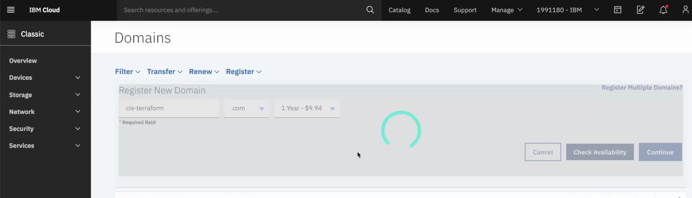
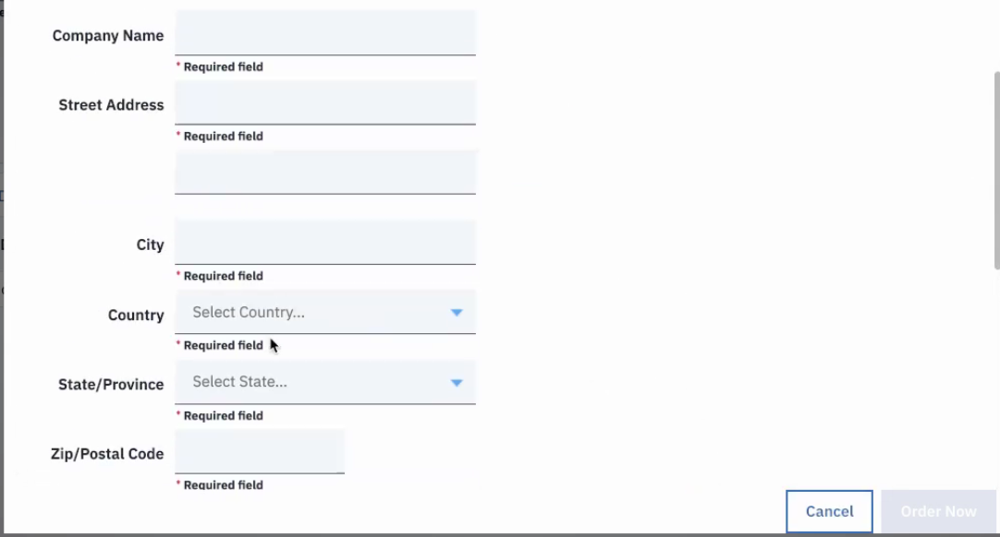
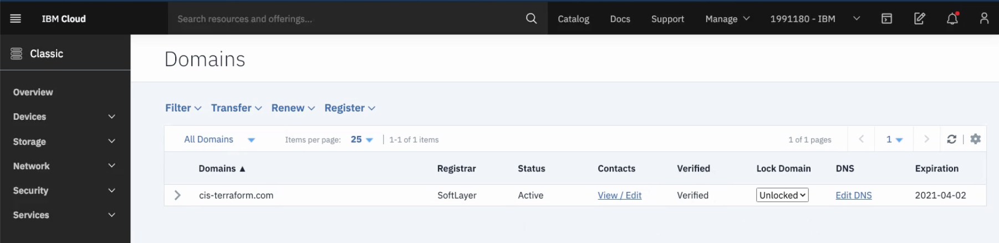
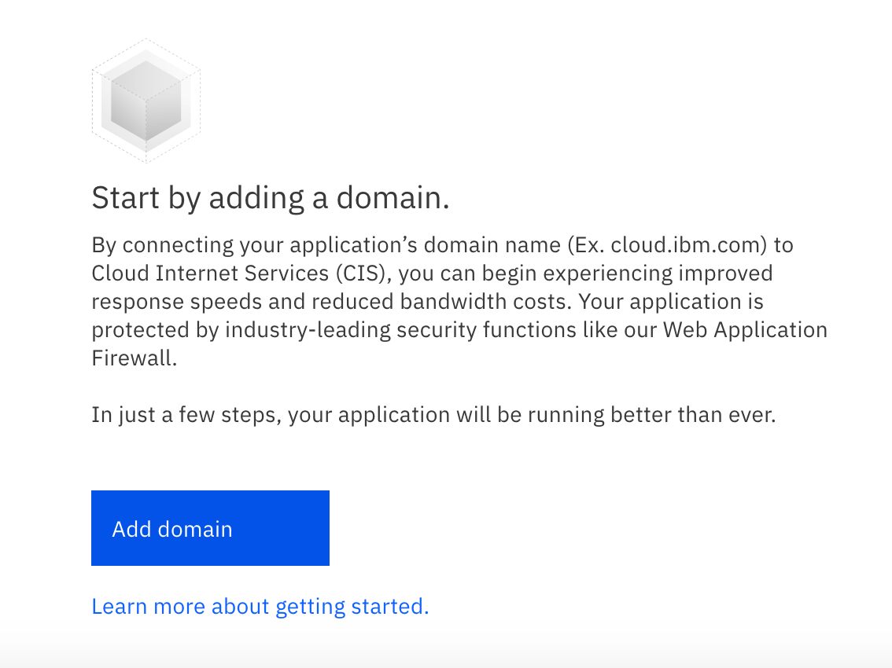
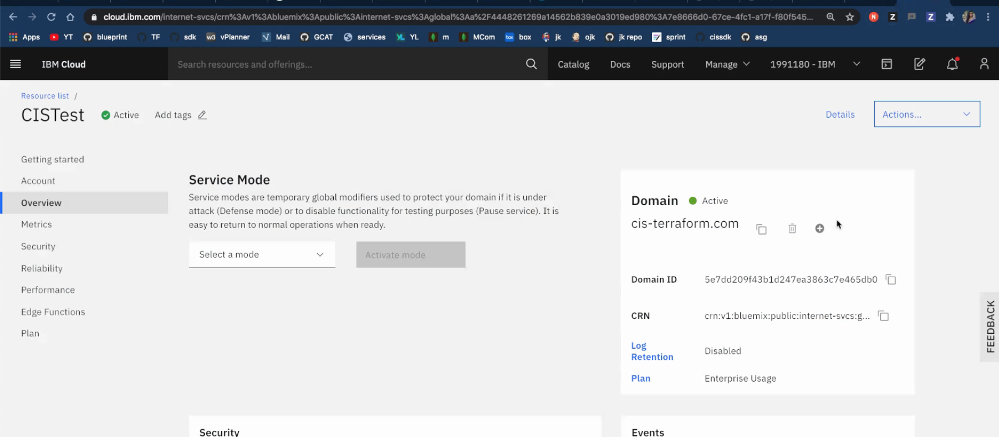
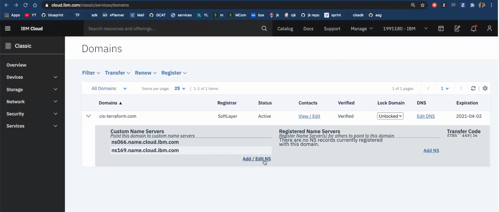
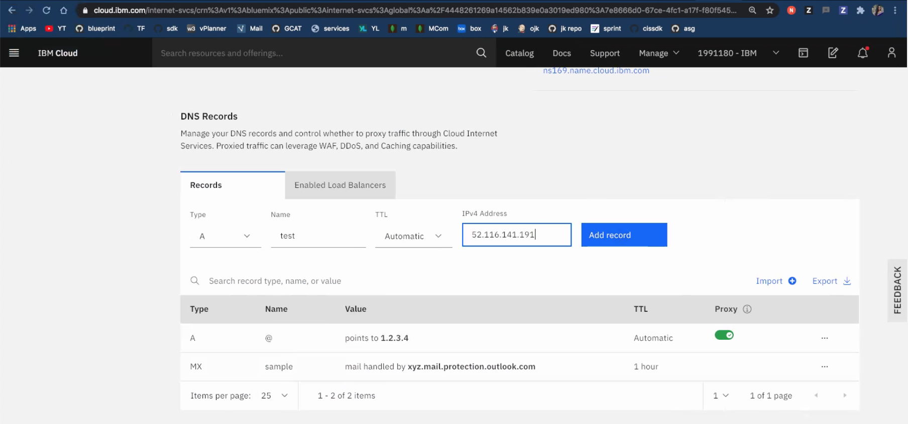
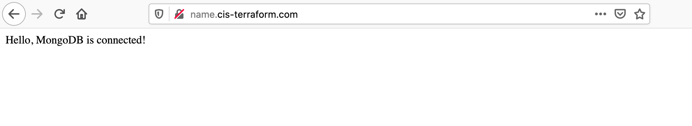

### Access your application using a Public Domain Name System (DNS)

The article below illustrates an example to access your application using a public domain name system (DNS). 

Public Domain name system has advantages over accessing your application using ip address, as ip addresses are hard to remember. There are security enhancements in DNS servers. DNS servers are designed for security purposes. They usually ensure that attempts to hack your server environment are thwarted before entry into your machines. 

We need a Domain name and DNS Record to access the application using Public Domain Name System.   

**Create a domain name in IBM Cloud**

If you already have a domain name in IBM Cloud - Classic Infrastructure, you can skip this section. Go to the section **Create Internet Services in IBM Cloud**.  

Now, let's create a domain name in IBM Cloud using Classic Infrastructure, VPC Gen 1. 

1. Login to IBM Cloud. Select IBM Classic Infrastructure. 

2. Select Services - Domains. 

3. Register a new domain as shown below. Enter the name of the domain as **cis-terraform**.   

4. Click **Check Availability**. Only when the domain is **Available**, try to create domain.    

5. Click **Continue**. Enter the details to complete registration. Enter your company address and provide your email address.   

6. Check your email inbox. You will receive mail with a link to verify. Sometimes, it is auto verified. Once, it is verified, you will find the status as **verified** under column **Verified** as shown below under **Services** - **Domains** - **cis-terraform** domain.   

**Create Internet Services in IBM Cloud**

1. Click on **Catalog** tab at the top menu bar in IBM Cloud. Search for **Internet Services**. Select **Internet Services**. Enter a Service name and select a resource group. Select **Enterprise Usage** plan. Click **Create**. 

2. Click **Add Domain** and enter the domain name as **cis-terraform.com**. Click **Next**. Skip DNS Records. Click **Next** in **Domain Management**. It will display 2 **Name Servers**.  Copy the domain name servers.    

3. Once the domain name is added, you will get a screen as shown below. Note the status will remain in **Pending**. After the DNS Name Servers are added in Classic Infrastructure - Domain, the status changes to **Active**.  In the screen shot below, the status is **Active** because the Name Servers copied are already added in IBM Cloud - Classic Infrastructure - Domains. 

**Add DNS Name Servers in IBM Cloud**

Now, let's add DNS name servers in IBM Cloud under Classic Infrastructure, VPC Gen 1. 

1. Login to IBM Cloud. Select IBM Classic Infrastructure. 

2. Select Services - Domains. 

3. Edit the Domain **cis-terraform.com** and add the DNS Name Servers copied from **Internet Services** - **Domain Management** screen.   

**Add DNS Records in Internet Services**

1. Go to the created Internet Services and check whether the status of domain is **Active**. Now, click **DNS Records** found under **Reliability** in the same screen below. Add a record of type **A** with Name as **name** and **IP address** pointing to your nodejs application floating ip address. Click **Add record**. 

> **Note**: Here, the DNS record added is **A record**. It is by default, listening in port 80 for http protocol and port 443 for https protocol. So, the nodejs application should be running in port number 80. Please see the screen shot below:  

2. Now, try to access the application as "**Name of A record . domain name**" as shown below:  

