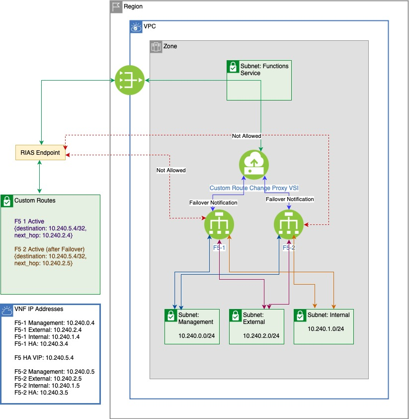
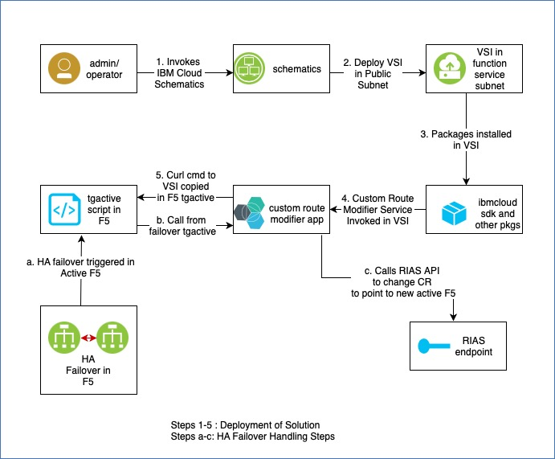
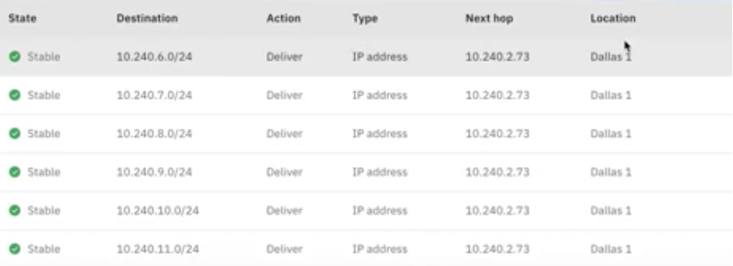

# F5 load balancer’s Active/Passive capability for Virtual Network Function(VNF) High Availability solution. 

Repository to store terraform, ansible, script files for F5 VNF High availability.

## Load Balancer HA-pair (Active - Passive)

## IBM Cloud Solution for F5 High Availability (Active - Passive)  

In the above setup, each F5 LB has 4 interfaces. This applies to a generic VNF as well.

* Management: Used for configuring the LB instance - subnet 10.0.240.0/24. Usually this subnet will need a public gateway so that the instance can connect to the public network for licensing purposes.
* HA: Used for clustering and monitoring the status of the pair - subnet 10.0.241.0/24.
* External/VIP: Receives traffic from applications targeting a Virtual IP Address (VIP) subnet. Each instance gets an (self) IP Address from this subnet. The VIP (separate from the self) is associated with the active instance in the HA pair. In this example the VIP also resides in subnet.
* Internal/Work: Distributes traffic amongst backend servers. Each instance gets an (self) IP Address from subnet. The backend servers receive traffic from a VIP (separate from the self) in subnet.

The terraform script creates a Ubuntu Virtual Server (VSI), ssh to the VSI using public SSH key, and installs Python, custom application and other installable. The VSI also logins to the F5 HA pair and updates the failover script to call the python application. 
 
Here is the custom application that updates the custom route’s next hop with F5 Active Load balancer  https://github.com/IBM-Cloud/vnf-samples/tree/master/vnf-ha-cloud-failover-func

When the F5 HA pair failover script gets triggered, it invokes the Python application to update next hop IP. The python application connects to VPC in Cloud using Python SDK and updates the next hop in Routing table. 

  

### Cloud Services used

IBM Cloud Virtual Private Cloud (VPC)     

IBM Cloud Schematics     

IBM Content Catalog        
