# Palo Alto VNF

Palo Alto Firewall standalone and high availability(single/multi-zone) setup in IBM Cloud and issues.

## IBM Cloud Setup for same/multi-zone VNF
-> Login to your IBM Cloud.\
-> Select VPC Infrastructure from the left Navigation Menu.

-> Select VPCs from the left Navigation Menu.
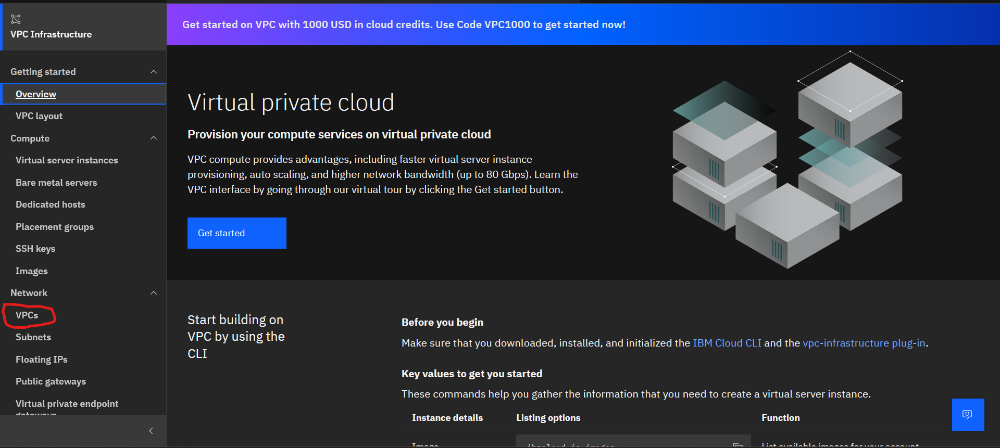

-> Now Create a new VPC by clicking on the top right button.

-> Select the Location and provide a unique name for the VPC. Also provide tags for identifying the resources but are optional. And keep the default options.

-> 3 default subnets would be created after clicking the “Create virtual private cloud” option from the right panel.

-> Verify the status as “Available” for the created VPC.

-> Now create 2 different subnets for 2 different zones each. Select Subnets from the left navigation menu.

-> Create a new subnet by clicking the Create button on the top right.

-> Create a new management subnet in Zone 1 by selecting proper zones and providing a unique name for the subnet and optional tags.

-> Keep in mind to select your created VPC under “Virtual private cloud” label.

-> Provide an IP address range unique to that specific zone. And click on “Create Subnet” button.

-> Verify the status as “Available” for created subnet.

-> Repeat the above subnet creation steps to create another subnet for data plane in the same zone and 2 more subnets (For management and data plane) in same/another zone for 2nd VNF.\
-> After creating a total of 4 subnets in 2 different zones (2 for each zone)/4 subnets in same zone, create the SSH key to later connect with the VNF for configuration.\
-> Run Windows CMD as administrator and type “ssh-keygen”.

-> Provide the unique path to store the keys. (Note: “C:\Users\00…04\Documents\ssh”  Here the ssh is the key name created automatically by the terminal in the designated path.)\
-> Provide a unique pass-phase when asked.

-> Go to the defined path and open the file with “Microsoft Publication” extension in notepad and copy the whole key (including ssh-rsa).

-> Now go to the IBM Cloud, select SSH Keys from the left navigation menu.

-> Create the new SSH by clicking on the “Create” button on top right.

-> Provide the necessary details with unique name for the SSH Key and provide the copied public key under “Public Key” label. And click on “Create” button.\
-> Verify if the SSH Key is generated successfully.

## Palo Alto VNF Setup

-> And click on “Catalog” option from the menu bar to create the Palo Alto VNF.

-> In the search tab type “palo alto” and select the “VM-Series Firewall – BYOL” from the option.

-> Keep all the default options and select the appropriate zone where the VPC is available.

-> Under “Set input variables”, provide necessary details.\
-> Select appropriate region under it.\
-> Provide SSH_Key name created before. (Note: Name of SSH Key not the ID).\
-> Provide Subnet ID 1 of the management subnet and Subnet ID 2 of the data subnet created before. (Note: ID of Subnet not the Name).\
-> Select the appropriate vnf_profile.\
-> Provide vnf_security_name unique to that zone. (Note: Provide a unique security group name that does not exist in the zone as Teraform will generate the security group automatically when creating the VNF). And click on “Install” button.

-> Verify if the Terraform commands executed successfully.

-> Verify if the created VSI/VNF is in “Running” state.

-> Wait for 10-15 minutes for the completion of the configuration on the created VSI/VNF. Then, scroll down to the bottom under “Subnet” section, reserve a floating address for the “eth0” interface by clicking on the pencil icon and under “Floating IP Address” selecting “Reserve a new Floating IP address” option. Save the changes.\
-> Click on the Floating IP Address of the management subnet.

-> Palo Alto home page will be opened in the browser. Reset password prompt would be displayed. 

-> Repeat the above steps for the creation of another VNF/VSI in same/another zone.

## Palo Alto High Availability Setup

### Pre-requisites: 

-> Setup two stand-alone Palo Alto VSI in same zone or in two different zones in same VPC.\
-> Only 2 default interfaces (“eth0” and “eth1”) are in use of both VSIs. If not, then the steps below remain the same only provided interfaces name would get changed. Then configure accordingly.

### VSI Setup

-> Create 1 more subnet for HA in zone where the first VSI is running.

-> Go to that Virtual Server Instance (VSI). It should be in running status.

-> Scroll down to “Network Interfaces” and create a new interface by clicking the “Create” button.

-> Use the new subnet created above for the new interface “eth2”.

-> Select the same security group as of “eth1”. And click on “Create”.

-> A new interface should be added to the “Network Interfaces” section.

-> To make the new interface available to the Palo Alto OS, reboot the VSI. Scroll Up and click on “Actions” on the top right corner.

-> Reboot the VSI. It will take some time to come up with “Running Status” (Around 5-10 mins).

-> Once the current VSI reboots, repeat the above “VSI Setup” steps for the second VSI.

### Palo Alto Setup

-> Login to the Palo Alto VSI by clicking the floating IP address of “eth0”.

-> First setup the “High Availability” window in the “Dashboard” by going to “Widgets” -> “Systems” -> “High Availability”.
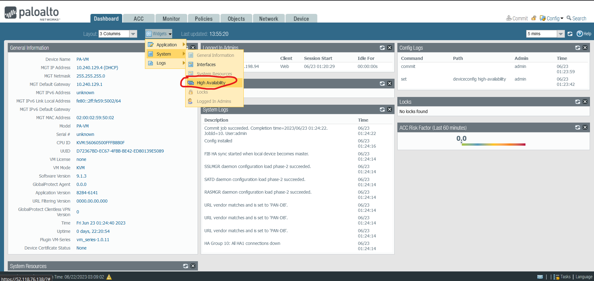

-> Click on “Network” tab to setup the two Palo Alto OS interfaces to high availability type (HA).

-> Select “ethernet1/1”. Provide optional description about it and select “Interface Type” as “HA”. Repeat the same for “ethernet1/2”.

-> Click on “Devices” tab to setup the high availability.

-> Select “High Availability” from the left navigation panel and to setup the “Control Link (HA1)”, click on the gear icon on the top right of the “Control Link (HA1)” window.\
-> Select port “ethernet1/2”, provide “eth2” interface private IP address of VSI (xxx.xxx.xxx.xxx) to “IPv4/IPv6 Address”. Also provide netmask as “255.255.255.0” and gateway IP address (xxx.xxx.xxx.1). And click on “OK”.\
NOTE: Gateway address is important if both VSIs are in different subnets.

-> Setup the “Data Link (HA2)” by clicking on gear icon. Check mark the “Enable Session Synchronization” box. Select the “ethernet1/1” port. Click on “OK”.

-> Setup the “Election Setting”. Provide a number in between 1 to 100 for “Device Priority”. Select “Preemptive” check box. Click on “OK”.\
NOTE: “Device Priority” value of” Active VNF” should be lower than “Passive VNF”. For example, if we consider 80 and 100 for two VNFs then 80 should be the value of “Active“ device and 100 for “Passive” device.

-> Setup “Active/Passive Setting”. Select “auto” for “Passive Link State” and click on “OK”.\
-> To commit the changes into the system, click on the “Commit” button on the top right corner.\
NOTE: It is important to commit the changes into the system after a setting gets saved/update.

-> Repeat the above Palo Alto steps for the second Palo Alto VNF/ Passive device.

### High Availability Setup

-> Finally, to achieve the HA in the Palo Alto VNFs, select the “High Availability” -> “Setup” gear icon.  Check the “Enable HA” box, provide a group ID (should be same for both active and passive device), provide optional description.\
-> Select “Mode” as “Active Passive” and for “Peer HA1 IP Address” provide the “Control Link (HA1) IP address” of the other device. (That is for “Active Peer HA1 IP Address” provide “Passive Control Link (HA1) IP address” and vice-versa.)\
-> Click on “OK” and “Commit” the changes in both the devices.

-> To verify the HA configuration, click on the “Dashboard” tab.

-> Check the “High Availability” window. To sync the setting in both the devices click on the “Sync button”.

-> After some time (around 5-10 mins) all the setting will get sync. And HA configuration will be completed in both the devices in same/different zones.

## PaloAlto HA Setup And CodeEngine Certificate Errors

### Code Engine Setup in IBM Cloud

-> Log in to IBM Cloud.\
-> Search for “Code Engine” in “ Search Resource and Product” box.
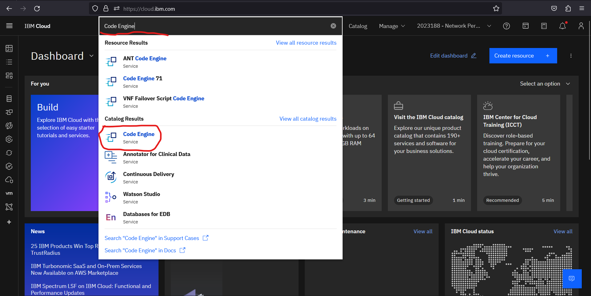

-> Click on “Project” from the left panel.
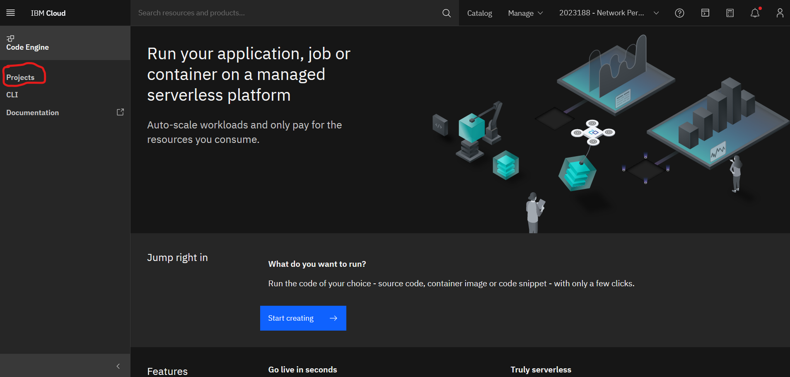

-> Create a new project by providing unique name and selecting the region where the VNFs resides. Then, click on create.

-> After creating a project, create an application by clicking the “Application” option from left panel.
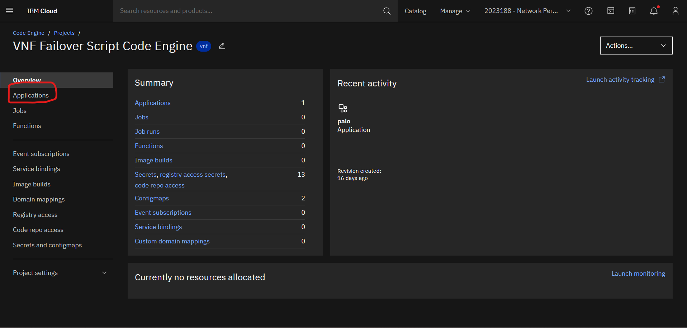

-> Provide a unique name, select “Container Image” and provide the image reference path. Also provide the port number(if any) to which the app would be listening and leave the rest of the default settings. Then, click on “Create”.

-> After a container is successfully created, test the link by clicking on the top right “Test Application” option and then on “Application URL”.
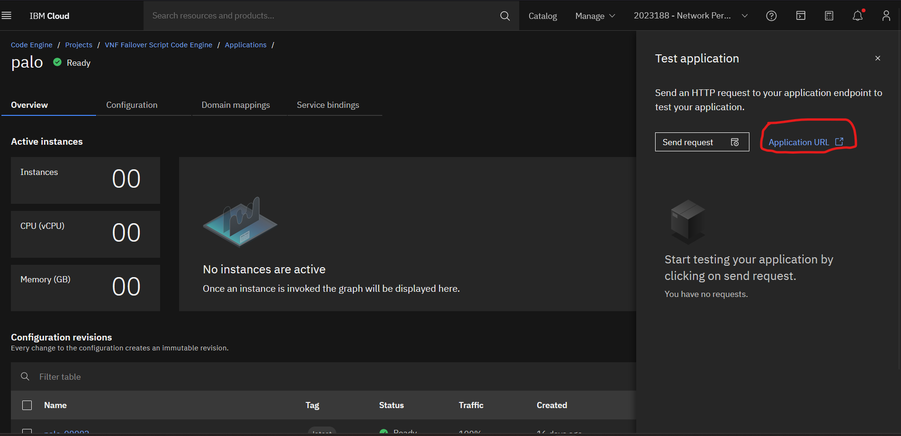

-> Copy the link opened in the new browser tab.
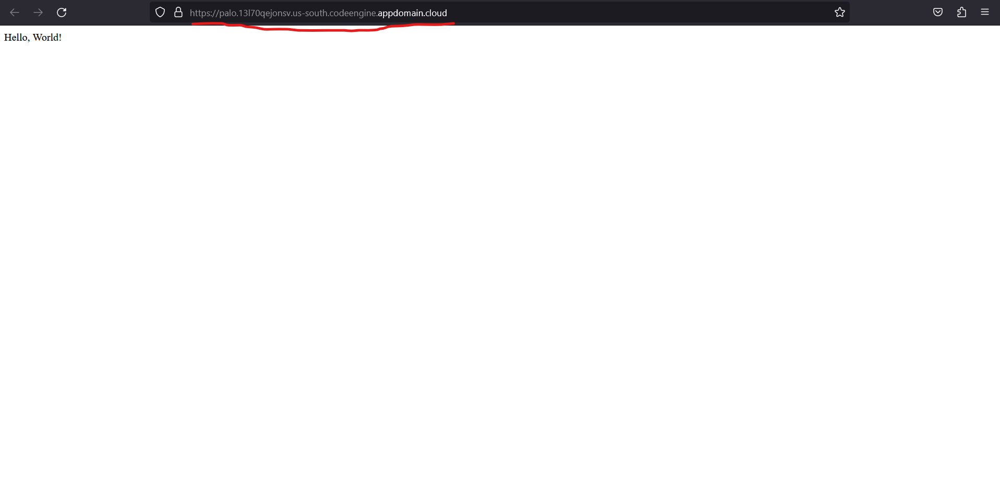

### Palo Alto Setup to send failover logs to Code Engine HTTP Server

-> Login to the active Palo Alto VNF.\
-> Go to “Devices” tab.\
-> From the left Panel under “Server Profiles”, click on “HTTP” and then click on “Add” button from the bottom to add a profile.\
-> A “HTTP Sever Profile” would be displayed.\
-> Provide details specifically the “Address” column. Provide the copied app link of Code Engine.(Note: Remove ‘Https://’ from the copied link.\
   Example, if copied link is “https:// palo.13l7qejonsv.ussouth.codeengine.appdomain.cloud/” then only provide “palo.13l7qejonsv.us-south.codeengine.appdomain.cloud”).\
->	Then, to check the connection, click on the “Test Server Connection” button.

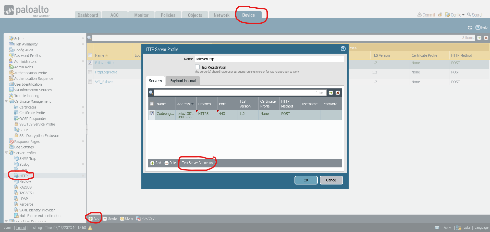

### Certificate Error of Code Engine Application

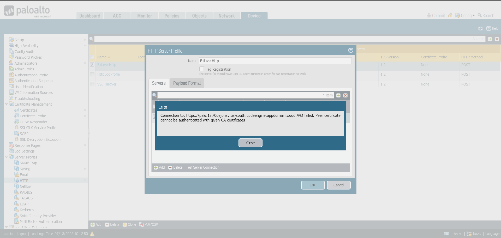

-> Palo Alto Firewall is trying to validate the Code Engine App’s address certificate to send firewall’s failover logs to a trusted server, but it’s not able to validate it.\ 
-> The certificate itself is valid, but the certificate chain is having a broken link.\
-> To inspect the app’s link, the certificate is tested on http://digicert.com/help and the below results were obtained which shows a broken link (scroll below).\
-> The Code Engine team is trying to resolve the above problem from the Code Engine end.\
-> But to avoid this from client-side Code Engine team proposed two ways:\
      1)	Get your own custom domain and certificate using CIS, Secrets Manager and Let'sEncrypt.\
      2)	Add the intermediate certificate  ISRG Root X1 DST Root CA X3 to your trust-store.

### Digicert Result

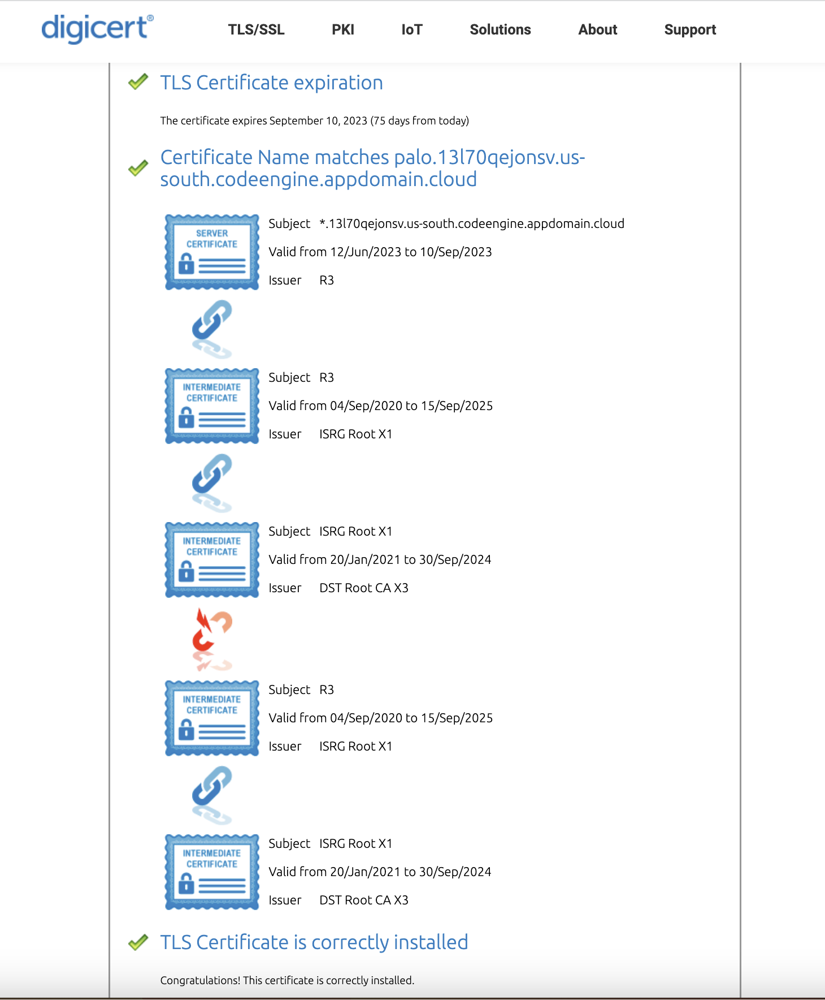

### HA Setup Error

-> After configuring the high availability in both Palo Alto Firewalls, they synchronize their configuration setting with each other.\
-> As shown in the below screenshots that after synchronization both firewalls have same network interface settings by default. If one interface setting is changed from UI or from CLI then it will get reflected in other also due to synchronization.
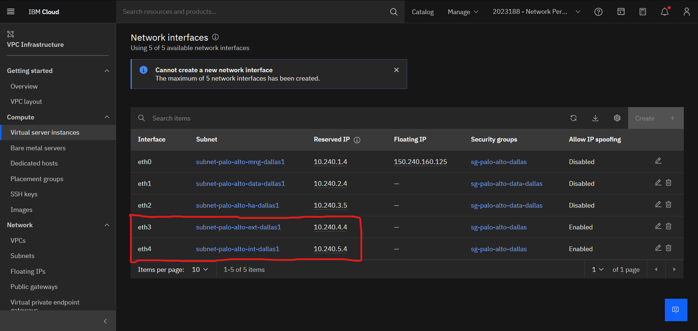

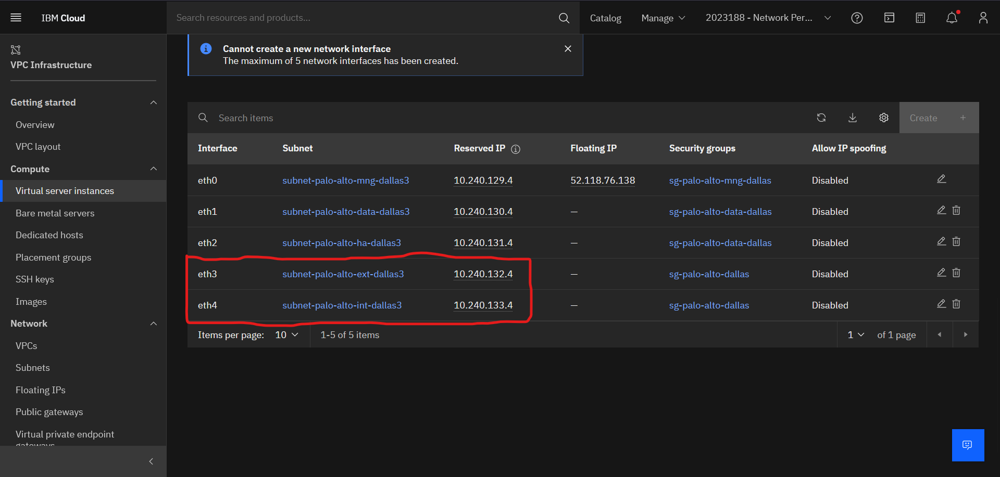

-> As shown in the above screenshots, both the firewalls shares the same ethernet1/3 and ethernet1/4 IP addresses.\
-> But they have different IP address configuration in the IBM cloud VSI network interfaces which are directly linked with these (ethernet1/3 and ethernet1/4) virtual interfaces in firewalls.\
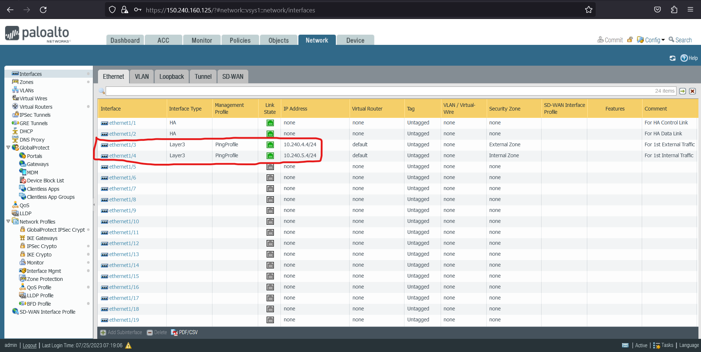

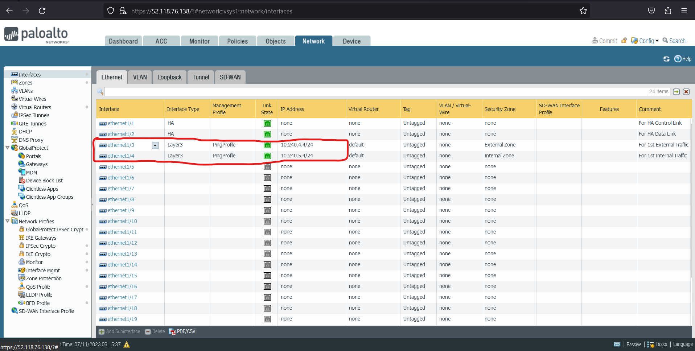

-> Due to these difference in IP address in both IBM cloud’s VSI interfaces(eth3 and eth4) and Palo Alto Firewall interfaces(ethernet1/3 and ethernet1/4) of passive firewall the traffics cannot be rerouted to it if a failover occurs in the active one.\
-> This issue can be resolved by using Virtual IP(VIP) address, which will enable both the VSIs to switch/share same IP addresses among themselves when a failover occurs as VIPs are not bounded to a particular interface so can be shared/transferred among multiple machines.\
-> Hence, HA setup is possible in IBM Cloud(single and multi-zone) but due to lack of VIP address support in IBM Cloud, for now the setup will not work. May work in future when VIP will be supported in IBM cloud.

