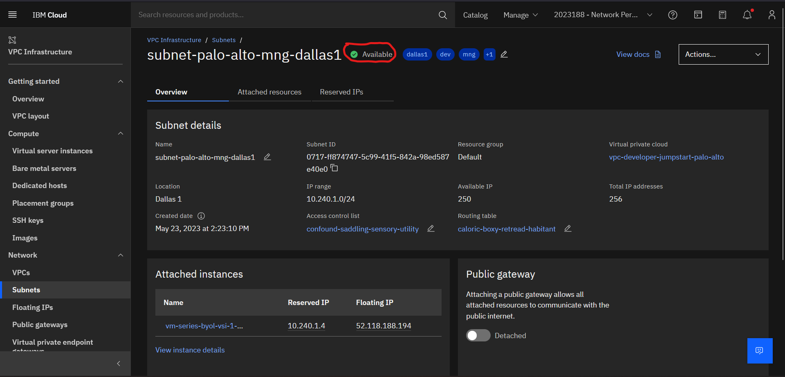

# Palo Alto VNF

Palo Alto Firewall standalone and high availability(single/multi-zone) setup in IBM Cloud and issues.

## IBM Cloud Setup for same/multi-zone VNF
-> Login to your IBM Cloud.\
-> Select VPC Infrastructure from the left Navigation Menu.

-> Select VPCs from the left Navigation Menu.

-> Now Create a new VPC by clicking on the top right button.

-> Select the Location and provide a unique name for the VPC. Also provide tags for identifying the resources but are optional. And keep the default options.

-> 3 default subnets would be created after clicking the “Create virtual private cloud” option from the right panel.

-> Verify the status as “Available” for the created VPC.

-> Now create 2 different subnets for 2 different zones each. Select Subnets from the left navigation menu.

-> Create a new subnet by clicking the Create button on the top right.

-> Create a new management subnet in Zone 1 by selecting proper zones and providing a unique name for the subnet and optional tags.

-> Keep in mind to select your created VPC under “Virtual private cloud” label.

-> Provide an IP address range unique to that specific zone. And click on “Create Subnet” button.

-> Verify the status as “Available” for created subnet.

-> Repeat the above subnet creation steps to create another subnet for data plane in the same zone and 2 more subnets (For management and data plane) in same/another zone for 2nd VNF.\
-> After creating a total of 4 subnets in 2 different zones (2 for each zone)/4 subnets in same zone, create the SSH key to later connect with the VNF for configuration.\
-> Run Windows CMD as administrator and type “ssh-keygen”.

-> Provide the unique path to store the keys. (Note: “C:\Users\00…04\Documents\ssh”  Here the ssh is the key name created automatically by the terminal in the designated path.)\
-> Provide a unique pass-phase when asked.

-> Go to the defined path and open the file with “Microsoft Publication” extension in notepad and copy the whole key (including ssh-rsa).

-> Now go to the IBM Cloud, select SSH Keys from the left navigation menu.

-> Create the new SSH by clicking on the “Create” button on top right.

-> Provide the necessary details with unique name for the SSH Key and provide the copied public key under “Public Key” label. And click on “Create” button.

-> Verify if the SSH Key is generated successfully.

## Palo Alto VNF Setup

-> And click on “Catalog” option from the menu bar to create the Palo Alto VNF.

-> In the search tab type “palo alto” and select the “VM-Series Firewall – BYOL” from the option.

-> Keep all the default options and select the appropriate zone where the VPC is available.

-> Under “Set input variables”, provide necessary details.\
-> Select appropriate region under it.\
-> Provide SSH_Key name created before. (Note: Name of SSH Key not the ID).\
-> Provide Subnet ID 1 of the management subnet and Subnet ID 2 of the data subnet created before. (Note: ID of Subnet not the Name).\
-> Select the appropriate vnf_profile.\
-> Provide vnf_security_name unique to that zone. (Note: Provide a unique security group name that does not exist in the zone as Teraform will generate the security group automatically when creating the VNF). And click on “Install” button.

-> Verify if the Terraform commands executed successfully.

-> Verify if the created VSI/VNF is in “Running” state.

-> Wait for 10-15 minutes for the completion of the configuration on the created VSI/VNF. Then, scroll down to the bottom under “Subnet” section, reserve a floating address for the “eth0” interface by clicking on the pencil icon and under “Floating IP Address” selecting “Reserve a new Floating IP address” option. Save the changes.\
-> Click on the Floating IP Address of the management subnet.

-> Palo Alto home page will be opened in the browser. Reset password prompt would be displayed. 

-> Repeat the above steps for the creation of another VNF/VSI in same/another zone.

